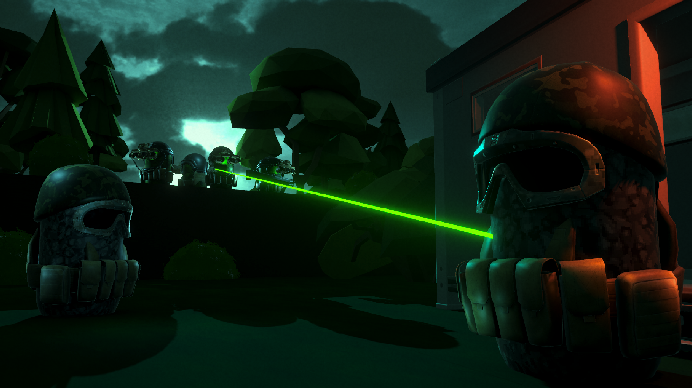

# Coalition: Black Eclipse

## Overview
Coalition: Black Eclipse is a tactical shooter inspired by the golden age of classic tactical shooters - Ghost Recon 1, Rainbow Six 3 and SWAT 4 to bring you a new take that blends the best parts of these games.

Take control of a team of mercenaries working for dubious contractors just to survive in a war torn world, where sometimes it's better to not ask any questions.

But when a job turns sour, your team are left to fight for themselves as you take matters into your own hands, deciding whether money comes before morals.

## How to install
Download the ZIP file using [this google drive link](https://drive.google.com/drive/folders/1rN4iZv_FrTbrqTIjbsEMxZKBnElJK_uv?usp=sharing).

Unzip in the folder of your choosing.

Run the `Coalition Black Eclipse.exe` application file, and enjoy!

**NOTE:** While the game has gone through several testing phases an many bugs fixed, some strange edge case bugs may be experienced in game. As a precaution, make sure the Alt + F4 keys are available, use them if you notice any intense framedrops or slowdowns in game.

## User Guide
### Main Menu
Upon opening the game, you will be greeted with a main menu. From here it is 
recommended that you go to the Controls / help menu by pressing the button on 
screen. Work through each page to be given information about the various game 
systems and features, with some more advanced tips to help you in game. 
All keybinds described here will be visible in game, so there is no need to write them 
down or memorise them.

### In Game Ui
**Top left – Teammate selection**

These boxes indicate your teammates, with a name and number. You will notice the 
teammates in the world will have the same number and colour box above their head. 
By using the select teammate keybind above, a teammate will be highlighted in yellow, 
ensuring that commands you place will be given to that ai unit. 

**Bottom left – ammo**

Each weapon has it’s own ammo pool. The big number on the right is your current 
ammo in your magazine, the smaller number represents the reserve ammo. At any 
point (if your current ammo is below your max magazine size) you can press R to 
reload, filling it after a second passes. Otherwise, the weapon will automatically reload 
itself if the current ammo count reaches 0. 

**Bottom middle – ability hotbar**

This bar will change to represent the abilities of the currently controlled character. You 
can press the key indicated below the slot to switch to that ability, and the remaining 
number of uses for that ability is displayed on the right hand side of the slot. 
When in the map view, this bar will change to represent the ability loadout of the 
currently selected teammate (the one highlighted in yellow) to make planning easier. 

**Top right – objectives**

These are your objectives. If you look around you will see two floating yellow diamond 
shaped icons. Head to this, press F to interact with the box to complete that objective. 

### Keybinds and game mechanics
**Personal (in first person)**

| Action | Key |
| ---- | ---- |
| Select Teammate | F1/F2/F3/F4 |
| Reload | R |
| Slow walk | Left Shift |
| Interact (with objectives, enemies and placed gadgets) | F |
| Map (open & close) | M |
| Select ability | 2,3,4,5,6 |
| Use ability | Right click |
| Switch character | Shift + (1/2/3/4) |
| Shoot | Left click |

**Ai Commands (when in first person, teammate selected in yellow)**

| Action | Key |
| ---- | ---- |
| Move to (crosshair position) | B |
| Look at (crosshair position) | V |
| Cast teammate ability | C |
| Queue command | Shift + (B/V/C) |

**Ai Commands (when in map view, teammate selected in yellow)**

| Action | Key |
| ---- | ---- |
| Move to (cursor position) | left click |
| Look at (cursor position) | Right click |
| Cast teammate ability | C |
| Queue command | Shift + (left click/right click/C) |

**Shared ai commands (both states, teammate selected in yellow)**

| Action | Key |
| ---- | ---- |
| Execute queued commands | 1 |
| Cancel all commands on teammate | X |

### Tips and hints
The main menu provides some hints and tips to help you play, but here are some to 
help you: 

- Move and aim slowly. The faster you move and aim, the more spread your 
weapon experiences. Try to slow walk and move the mouse gently to maintain 
high accuracy. 
- Use teammates to watch spaces of the level you cannot cover yourself
- Experiment with abilities to scout ahead, distract enemies and aid with taking 
ground. 
- Use ability queues and play alongside your teammates. 
- Aim for headshots. Aim around goggle height to deal double damage to 
enemies. 
- Clear out enemies, head to your objective and complete those to win.
- If all your teammates die, you lose. 

## Progress Videos
27/11
https://youtu.be/7EsIGPqngto

11/12
https://youtu.be/sc_CFgkipkk

19/02
https://youtu.be/-DgzJrUxgqM
 
